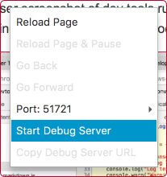
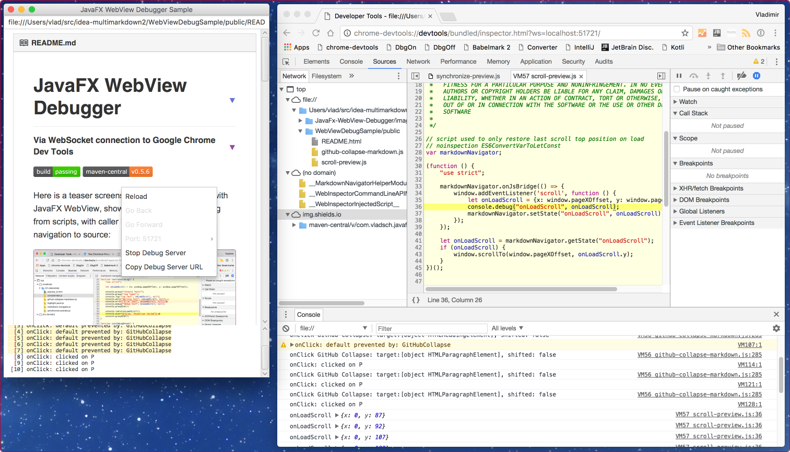

## WebView Debug Sample

WebView Sample application with full featured Chrome Dev Tools debugging using
[JavaFx WebView Debugger] library.

To try it out download the [WebViewDebugSample.jar] to an empty directory. The application will
create `public` directory for its HTML page and resources and save a JSON file of script state
into `WebViewDebugSample.json` in this directory.

```shell
java -jar WebViewDebugSample.jar
```

The application will launch and open the [Javafx Web View Debugger Readme] file as it was
converted to HTML by [Markdown Navigator] plugin, out of laziness and because this page has
enough script action to be a good example of debugger's use.

Using the context menu on the main page:

1. click on the `Start Debug`

   ,

2. Click on the `Copy Debug Server URL`

   

3. open Google Chrome, paste the URL in its address bar and hit ENTER.

4. Hit **⌘R** on OS X or **Ctrl+F5** on Windows/Linux to reload the page being debugged.

5. Enjoy full featured debugging of JavaFX WebView!

   

[Javafx Web View Debugger Readme]: https://github.com/vsch/Javafx-WebView-Debugger/blob/master/README.md
[JavaFx WebView Debugger]: https://github.com/vsch/Javafx-WebView-Debugger
[Markdown Navigator]: http://vladsch.com/product/markdown-navigator 
[WebViewDebugSample.jar]: WebViewDebugSample.jar

