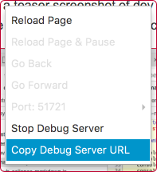

## WebView Debug Sample

WebView Sample application with full featured Chrome Dev Tools debugging using
[JavaFx WebView Debugger] library.

[](https://travis-ci.org/vsch/WebViewDebugSample)
[](https://search.maven.org/search?q=g:com.vladsch.javafx-webview-debugger)

To try it out download the [WebViewDebugSample.jar] to an empty directory. The application will
create `public` directory for its HTML page and resources and save a JSON file of script state
into `WebViewDebugSample.json` in this directory.

```shell
java -jar WebViewDebugSample.jar
```

The application will launch and open the [Javafx Web View Debugger Readme] file as it was
converted to HTML by [Markdown Navigator] plugin, out of laziness and because this page has
enough script action to be a good example of debugger's use.

Using the context menu on the main page:

1. click on the `Start Debug`

   ,

2. Click on the `Copy Debug Server URL`

   

3. open Google Chrome, paste the URL in its address bar and hit ENTER.

4. Hit **⌘R** on OS X or **Ctrl+F5** on Windows/Linux to reload the page being debugged.

5. Enjoy full featured debugging of JavaFX WebView!


### Context Menu Actions

* `Reload Pag `: reload the current page
* `Reload Page & Pause`: reload the current page and pause in debugger on script execution in the page body
* `Go Back`: go to previous address in history
* `Go Forward`: go to next address in history
* `Port: x` :  shows the current port
  * `Change to: x-1`: allows changing to previous port
  * `Change to: x+1`: allows changing to next port
* `Start Debugging`: start debug web-socket server
* `Stop Debug Server`: stop debug web-socket server
* `Copy Debug Server URL`: copy the debug web-socket URL to clipboard

## Available on Maven

```xml
<dependency>
    <groupId>com.vladsch.javafx-webview-debugger</groupId>
    <artifactId>webview-debug-sample</artifactId>
    <version>0.6.2</version>
</dependency>
```

[Javafx Web View Debugger Readme]: https://github.com/vsch/Javafx-WebView-Debugger/blob/master/README.md
[Web View Debug Sample]: https://github.com/vsch/WebViewDebugSample
[JavaFx WebView Debugger]: https://github.com/vsch/Javafx-WebView-Debugger
[Markdown Navigator]: http://vladsch.com/product/markdown-navigator
[WebViewDebugSample.jar]: https://github.com/vsch/WebViewDebugSample/raw/master/WebViewDebugSample.jar

